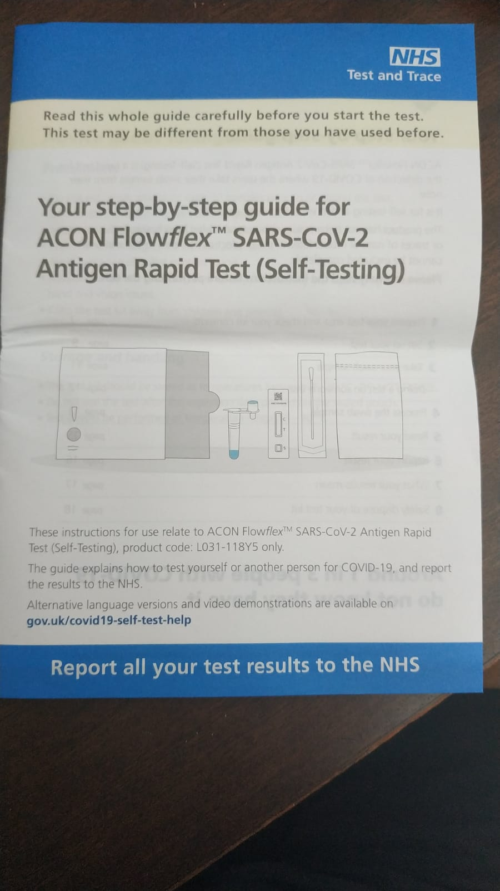
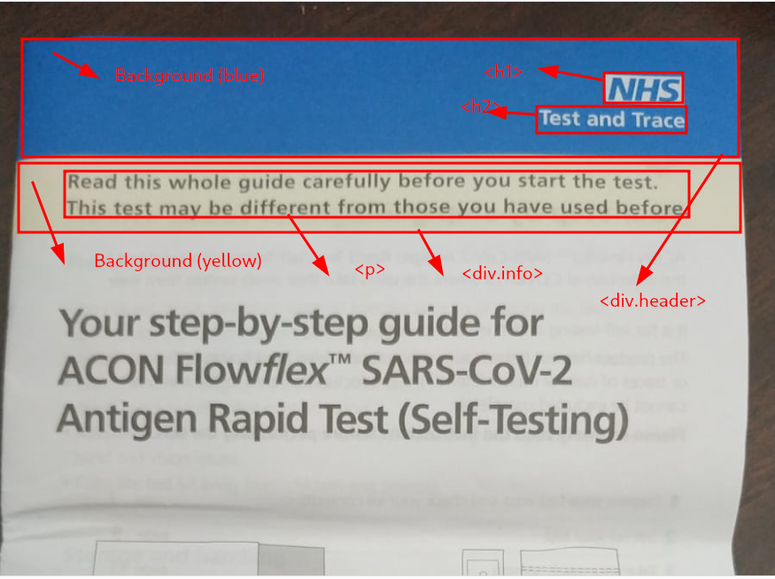
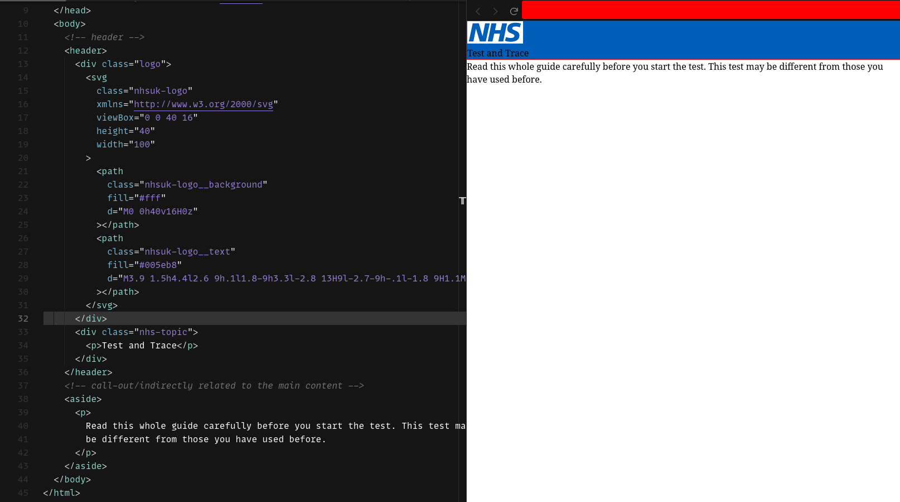
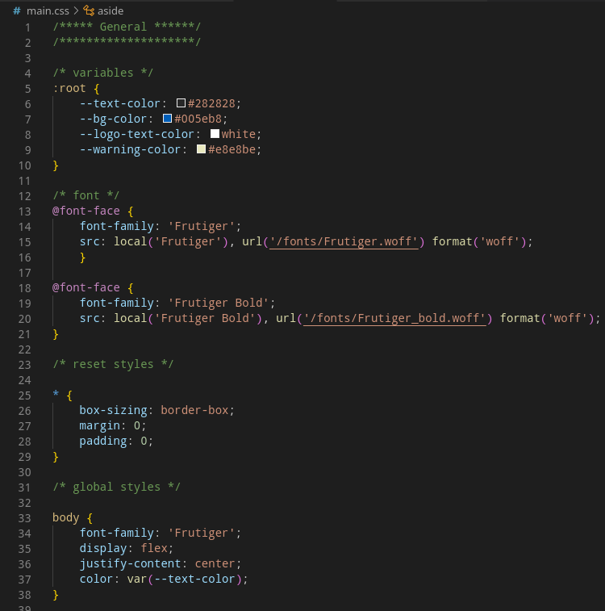
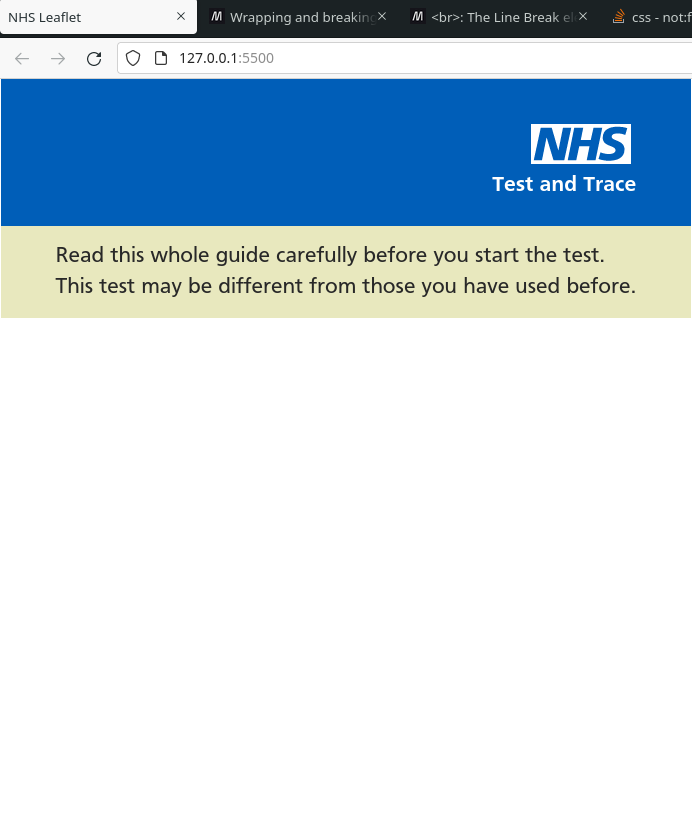

# NHS-leaflet-page
This little project was born from a chat with my big brother Krizalias. He just got into web developement and all the help I can give to make his learning expericence better than it was mine, is main goal here. Also, since the project involves HTML and CSS, I seee it a great opportunity to brush up on the core technologies for building web pages.  

## Walkthrough the web development approach
I randomly picked a design to translate into the web and it happened to be an MHS leaflet kept in my drawer all this time!

Rady to get started!

First thing I did, it was spending a few minutes looking at the design and decide which parts or part of it I would want to recreate on the web. The reason being is that I have always been an advocate of working in small chunks; it helps one to get something done from start to finish while learning along without losing focus. At least that method always works for me! 

Next, I took a screenshot of the leaflet and downloaded into my pc. Then I loaded it into my screenshot app and drew boxes around the elements that make up the page. Also writing the html elements of each of the boxes helps me visualize what is what and perhaps make the changes needed until I am happy with the structure before writing any code. By the way, I used a screenshot app that allow me to draw and write text to any image, but you could perfectly use pen and papper too. **See screenshots!**

NHS leaflet | Highlighted leaflet
:-----------:|:-----------------:
 | 

### Look up information
One extra step I like to do, it is looking up information regarding things I don't fully understand _*(Web development wise)*_. throuhg googling, reading documentation or asking foruns and other develpers you may know. It's all down to preference or based on how one learns better something. I personally like to consult any good documentation on anything that I am working on web development more than the other ways.

Let's say, I know more or less how I will go about building the leaflet based on the `Highlighted leaflet` screenshot. But to make sure my thoughts process are implementing the best practices out there, I always like to check the documentation for the best practices on whatever it is that I am using. That can be an HTML element or a CSS rule. When I am not 100% sure I understand the explanations provided on the documentation, I will refer to videos _*(preferrably shorts ones)*_ and other good resources. Here's the link for documentation I often refer when I am building websites -> [click here](https://developer.mozilla.org/en-US/docs/Learn).

### Writing the HTML
Without going into details,`HTML` is a markup language that tells the browser how the document content is structured. There are a lot of resources on the internet that explain how to code `HTML`, its syntax as well as anatomy - __*one of them is found through the link above*__ . I recommend anyone that just started or knows very little about the topic to go and do some research and spend some time solidifying the knowledge acquired along the learning journey. 

Also, those who spend some time reading up on good resources often , are likly to be up to date with the technologies and in a good position to implement the best practices to date. For exemple, I know that `HTML 5` introduced new elments that provide with meaning, making it easier:
- for browsers to understand the content which improves `SEO`; 
- to screen readers software, with giving a better web pages navigation experience to impared visual users
- to developers to understand and maintain the source code.

Some of those elements are applied in the source code as you ca see in the following **screenshot**

HTML code |
:--------:

The `header` and `aside` elements could be easily replaced by `div` and working the same visually talking. But `div` carries no meaning; its job is only to divide or group content. Whereas `header` and `aside` provide meaning. That is, you can easily understand that `header` is the header of the whole document and `aside` is a piece of information that isn't directly related to the main content; it kind of warns and says something that it's worth to keep an eye or to know in the page.

### Writing the CSS
The next step is styling the web page with CSS. Again, it is important to spend some time getting to know the language and its use. For example, there are:
- a few ways to set it up _*(I have the html to link in the css file)*_. 
- a lot of rules that are applied to the the page, including importing web fonts or features like `CSS VARIABLES`, that will get you the page looking that matches with the one in the leaflet. 

My CSS file has:
- comments to organize the document.
- the use of `CSS Variables`
- a bunch of rules applied to get the page design close to the one in the leaflet. 

I would say, get the project cloned to your machine; use text editor that let you view the web through a built-in live server. For instance, VSCode has an extension called Live Server that can be donloaded and immediately ready to serve any static web page. Perhaps you want to take a look at the code and try to understand all it was done how it was done line by line. In addition to it, please do remember to use the **MDN** documention as it explains most of the stuff I did in much more detail. **See the screenshots**

CSS code | Web Page
:--------:|:------:
 | 

### Something you may want to know
As I wanted to build a page that matches the leaflet design, I visited the **NHS** website and opened up the DEV TOOL, which is available in any of the main browsers that let me inspect some espefic info such as the logo or font. For example, I learnt that they logo is an SVG _*(search for that at your own time)*_ and the font wasn't available in my operating system by default. So I searched for it online, downloaded it and used it with the web fonts feature  _*(search for that at your own time)*_.

If you don't know about or have never worked with DEV TOOLS, it may be something you want to get some hands-on experience in the future; the tool comes with a lot of features that make the developer's work a a lot easier! 

#### Credits
I want to thank my man Krizalias once again for the inspiring chat that made me go building this little project. I hope that this is the first of many to come!

